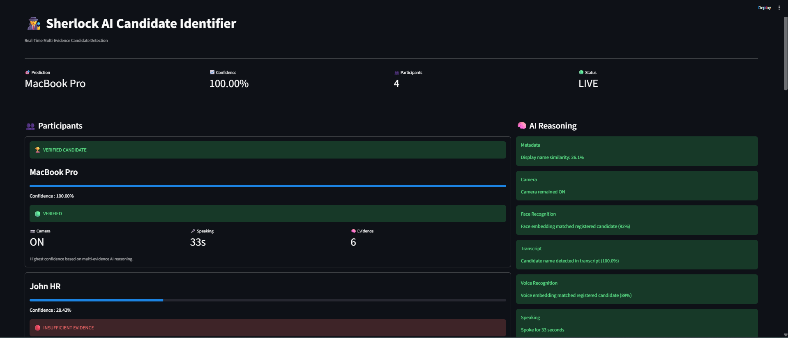
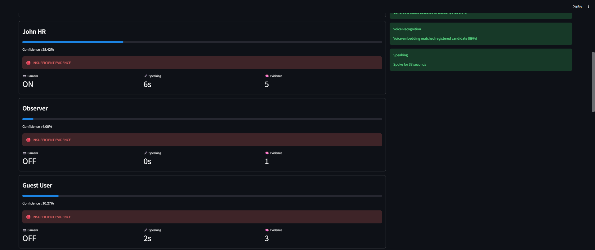
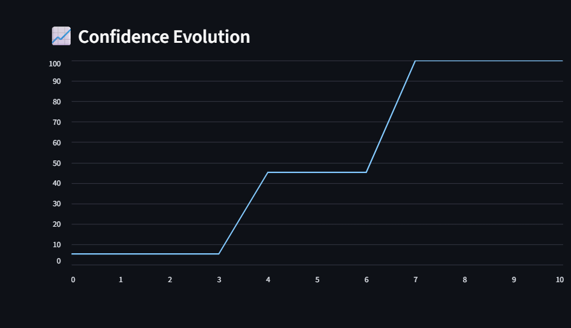
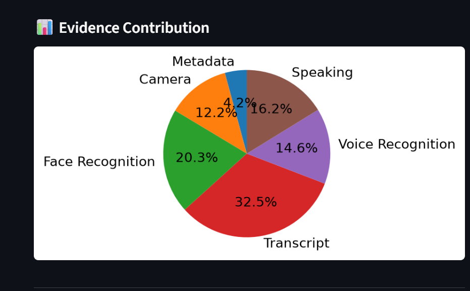
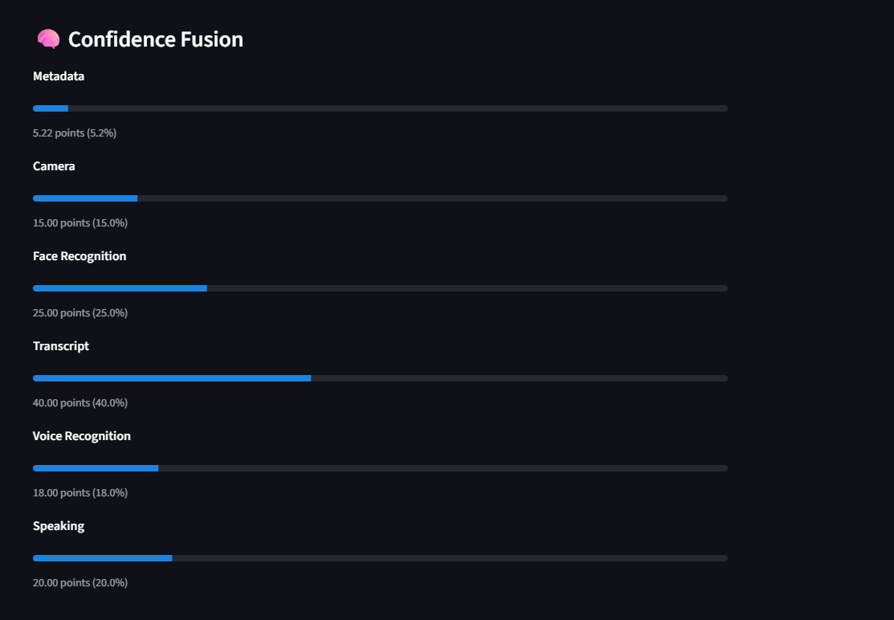
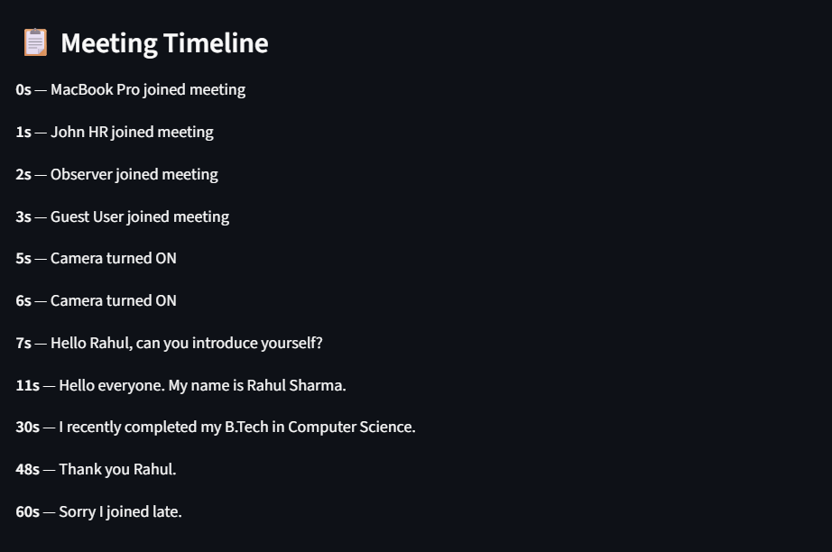
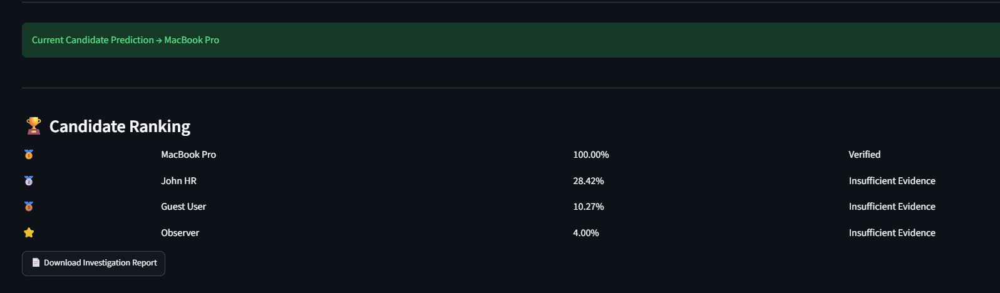
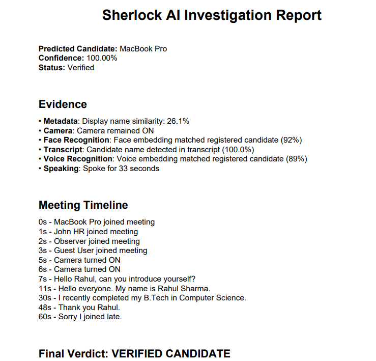
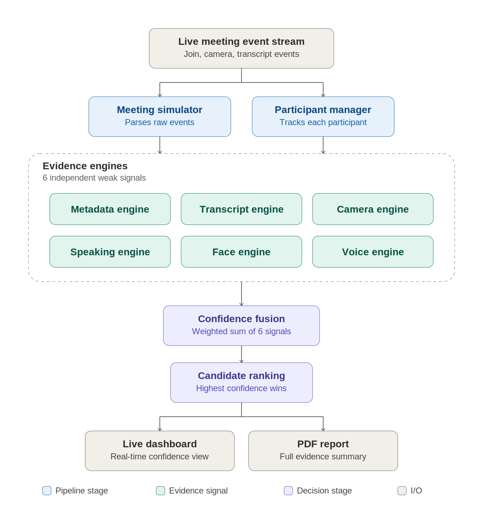

# 🕵️ Sherlock AI Candidate Identifier

### AI-Powered Multi-Evidence Candidate Identification Prototype

> 🚀 **An explainable AI system that identifies the real interview candidate in live meetings using metadata, transcript intelligence, camera activity, speaking behavior, simulated face recognition, simulated voice recognition, and confidence fusion.**

[](https://www.python.org/)
[](https://streamlit.io/)
[](https://en.wikipedia.org/wiki/Artificial_intelligence)
[](https://github.com/Radha-byte/Sherlock-Candidate-Identifier)
[](LICENSE)

---

## 🌟 Highlights

- 🕵️ Multi-Evidence Candidate Identification
- 🤖 Explainable AI Decision Making
- 📊 Interactive Streamlit Dashboard
- 📈 Confidence Evolution Tracking
- 🥧 Evidence Contribution Visualization
- 📋 Meeting Timeline
- 📄 Automatic PDF Investigation Report
- 🏆 Professional GitHub Documentation

## 🛠️ Tech Stack

| Category | Technology |
|-----------|------------|
| Programming Language | Python 3.12 |
| Frontend | Streamlit |
| Backend | Python |
| AI Logic | Multi-Evidence Confidence Fusion |
| NLP | RapidFuzz |
| Data Visualization | Matplotlib |
| PDF Reports | ReportLab |
| Testing | Python unittest |
| Version Control | Git & GitHub |

## 📊 Project Statistics

| Metric | Value |
|---------|------:|
| AI Evidence Engines | 6 |
| Dashboard Pages | 1 |
| Python Modules | 20+ |
| Test Files | 4 |
| Charts & Visualizations | 3 |
| PDF Report Generator | ✅ |
| Explainable AI Reasoning | ✅ |

# 📌 Project Overview

Sherlock AI Candidate Identifier is an explainable AI system designed to identify the real interview candidate in online meetings using multiple evidence sources instead of relying on a single signal.

The system continuously analyzes meeting participants and combines metadata, transcript analysis, speaking behavior, camera activity, simulated face recognition, and simulated voice recognition into a unified confidence score.

The candidate with the highest confidence is continuously identified as new meeting events are processed while providing transparent AI reasoning for every decision.

---

## 📌 Assumptions

- The prototype processes timestamped meeting events from a simulated interview session.
- Face and voice recognition modules simulate confidence scores to demonstrate the multi-evidence pipeline.
- Metadata is assumed to be available before the interview begins.
- Confidence scores are updated whenever new participant evidence is received.

# ✨ Features

- ✅ Metadata Analysis
- ✅ Transcript Intelligence
- ✅ Camera Activity Detection
- ✅ Speaking Pattern Analysis
- ✅ Simulated Face Recognition
- ✅ Simulated Voice Recognition
- ✅ Confidence Fusion Engine
- ✅ Candidate Ranking
- ✅ Explainable AI Reasoning
- ✅ Live Streamlit Dashboard
- ✅ Investigation PDF Report

---

# 🧠 AI Pipeline

```
Meeting Data
      │
      ▼
Meeting Simulator
      │
      ▼
Participant Manager
      │
      ▼
Metadata Engine
Transcript Engine
Camera Engine
Speaking Engine
Face Engine
Voice Engine
      │
      ▼
Confidence Engine
      │
      ▼
Confidence Fusion
      │
      ▼
Explainable AI Reasoning
      │
      ▼
Candidate Ranking
      │
      ▼
Dashboard + PDF Report
```
---


## 🖥 Dashboard Preview

The Sherlock AI dashboard provides real-time visualization of candidate identification using multiple evidence sources. It displays participant confidence scores, AI reasoning, evidence contribution, confidence evolution, meeting timeline, and investigation report generation.

---

## 🏠 Main Dashboard (Top Section)



---

## 📋 Main Dashboard (Bottom Section)



---

## 📈 Confidence Evolution

This graph shows how the confidence score changes as new evidence is collected during the interview.



---

## 🥧 Evidence Contribution

This pie chart illustrates how each evidence source contributes to the final confidence score.



---

## 🎯 Confidence Fusion

The Confidence Fusion Engine combines metadata, transcript analysis, camera activity, speaking behavior, face recognition, and voice recognition into a single confidence score.



---

## 📋 Meeting Timeline

The dashboard also visualizes all interview events in chronological order.



---

## 📄 Investigation Report

The application can generate a downloadable PDF report summarizing the entire investigation.



### Sample Generated Report

<p align="center">
  
</p>

> **Sample investigation report generated by the application after processing the interview evidence.**


# 📂 Project Structure

```text
Sherlock-Candidate-Identifier/
│
├── backend/
├── frontend/
├── tests/
├── data/
├── docs/
├── screenshots/
├── demo/
│
├── app.py
├── requirements.txt
├── README.md
└── LICENSE
```

---

# ⚙️ Installation

Clone the repository

```bash
git clone https://github.com/Radha-byte/Sherlock-Candidate-Identifier.git
```

Move into project

```bash
cd Sherlock-Candidate-Identifier
```

Create virtual environment

```bash
python -m venv .venv
```

Activate

Windows

```bash
.venv\Scripts\activate
```

Install dependencies

```bash
pip install -r requirements.txt
```

Run

```bash
streamlit run app.py
```

After launching the application, open the following URL in your browser:

```text
http://localhost:8501
```

---

# 📈 AI Evidence Sources

| Evidence | Purpose |
|-----------|---------|
| Metadata | Compare registered candidate information |
| Transcript | Detect self introduction |
| Camera | Monitor participant camera activity |
| Speaking | Measure speaking duration |
| Face Recognition | Simulated face matching |
| Voice Recognition | Simulated voice similarity |

---

# 🚀 Future Enhancements

- 🟢 Live Google Meet Integration
- 🟢 Live Microsoft Teams Integration
- 🟢 Live Zoom Integration
- 🟢 Deep Learning Face Recognition
- 🟢 Voice Biometrics
- 🟢 Deepfake Detection
- 🟢 Liveness Detection
- 🟢 REST API
- 🟢 Docker Deployment
- 🟢 Cloud Deployment (AWS/Azure)
- 🟢 Online Learning from Previous Interviews

---

# 📊 Evaluation

## Testing

- Unit testing of evidence engines
- Manual validation using simulated interview sessions
- Confidence score verification
- Candidate ranking validation

## Edge Cases

- Candidate joins with incorrect display name
- Multiple participants join simultaneously
- Missing transcript information
- Candidate camera disabled
- Ambiguous participant identities

## Current Limitations

- Uses simulated meeting events instead of live meeting APIs
- Face and voice recognition modules are simulated
- No direct Zoom/Google Meet integration

## Accuracy

The prototype demonstrates explainable candidate identification using multiple evidence sources. Accuracy depends on the quality and completeness of the available evidence.

# 🏗 Architecture

   <p align="center">
  
   </p>

   Meeting events flow through a simulator and participant manager into six independent evidence engines (metadata, transcript, camera, speaking, face, voice — see Assumptions for which are simulated). Each engine scores independently; a weighted-sum fusion stage combines them into one confidence score, which drives candidate ranking, the live dashboard, and the PDF report.

```

You can also view a rough idea from:
docs/architecture.md
```

---

# 👨‍💻 Developer

**Radha Rani**

B.Tech CSE Student

VIT Bhopal University

---

# ⭐ If you like this project

Please consider giving it a star ⭐

## 📜 License

This project is licensed under the MIT License.
See the LICENSE file for details.
