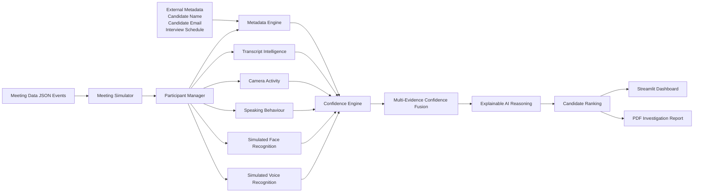

# 🕵️ Sherlock AI Candidate Identifier Architecture

The Sherlock AI Candidate Identifier uses a **multi-evidence AI pipeline** to continuously identify the correct interview candidate during a live meeting. Instead of relying on a single rule, the system combines multiple weak signals, calculates a unified confidence score, explains every decision, and continuously updates the prediction as new meeting events arrive.

---

## Pipeline Overview

### 1. Meeting Data
The system receives meeting events such as:
- Participant joins
- Display names
- Camera activity
- Speaking duration
- Speaker-attributed transcripts

### 2. External Metadata
The registered candidate information (candidate name, email, and interview schedule) is used as additional context for identity verification.

### 3. Meeting Simulator
Simulates a live interview by processing meeting events sequentially.

### 4. Participant Manager
Maintains the state of every participant throughout the interview.

### 5. AI Evidence Engines
Multiple evidence engines independently analyze participant behavior:

- Metadata Engine
- Transcript Intelligence
- Camera Activity
- Speaking Behaviour
- Simulated Face Recognition
- Simulated Voice Recognition

Each engine contributes partial evidence instead of making the final decision alone.

### 6. Confidence Engine
Calculates an updated confidence score after every new event.

### 7. Multi-Evidence Confidence Fusion
Combines the confidence contributions from all evidence engines into a single explainable score.

### 8. Explainable AI Reasoning
Records why confidence increased or decreased, making the final decision transparent and interpretable.

### 9. Candidate Ranking
Ranks all meeting participants according to their confidence scores and continuously updates the predicted candidate.

### 10. Output
The final prediction is presented through:

- Interactive Streamlit Dashboard
- PDF Investigation Report