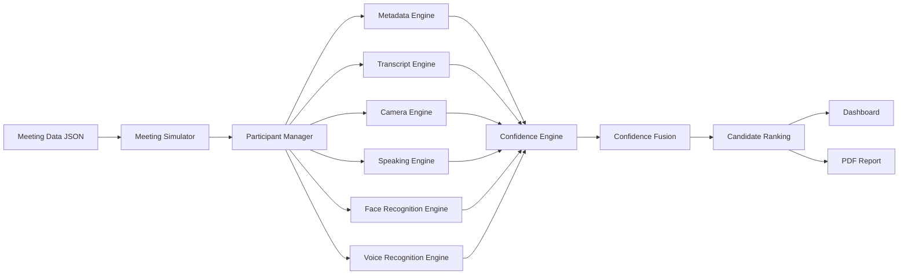

# Sherlock AI Candidate Identifier Architecture

```mermaid
flowchart LR

A[Meeting Data JSON]

A --> B[Meeting Simulator]

B --> C[Participant Manager]

C --> D[Metadata Engine]

C --> E[Transcript Engine]

C --> F[Camera Engine]

C --> G[Speaking Engine]

C --> H[Face Recognition Engine]

C --> I[Voice Recognition Engine]

D --> J[Confidence Engine]
E --> J
F --> J
G --> J
H --> J
I --> J

J --> K[Confidence Fusion]

K --> L[Candidate Ranking]

L --> M[Dashboard]

L --> N[PDF Report]
```